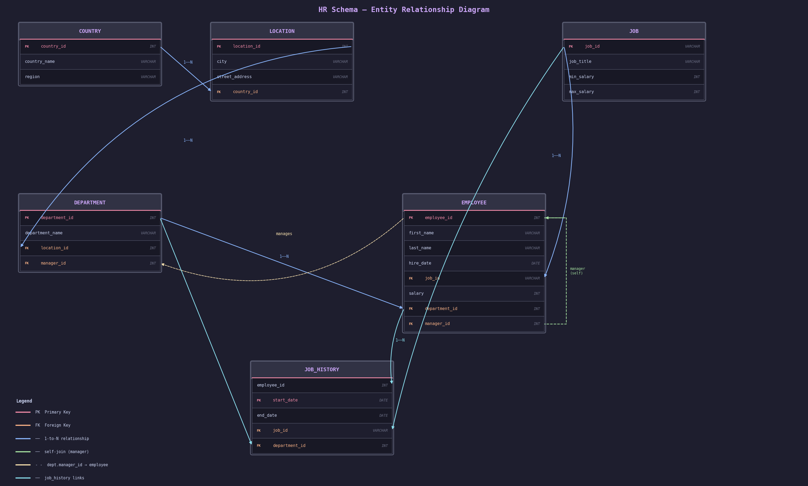
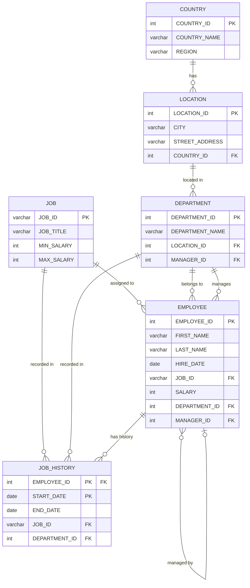

# 01 — Schema

## Entity-Relationship Diagram



> **Reading the diagram**
> - `PK` (red) = Primary Key &nbsp;|&nbsp; `FK` (orange) = Foreign Key
> - Blue arrows = 1-to-N relationship
> - Green dashed bracket = self-join (`manager_id → employee_id`)
> - Yellow dashed arrow = `department.manager_id → employee`
> - Cyan arrows = `job_history` links (employee + job + department)

---

<details>
<summary>Mermaid source (text version)</summary>



</details>

---

## Relationship Summary

```
COUNTRY (1) ──── (N) LOCATION (1) ──── (N) DEPARTMENT
                                                │
                                                │ (1)
                                                │
              JOB (1) ────────────── (N) EMPLOYEE ─(self)─► manager_id
               │                          │
               └────── (N) JOB_HISTORY ───┘
                         (employee_id + start_date = PK)
```

---

## DDL — Create Tables

```sql
-- 1. COUNTRY
CREATE TABLE country (
    country_id   INT          PRIMARY KEY,
    country_name VARCHAR(60)  NOT NULL,
    region       VARCHAR(30)
);

-- 2. LOCATION
CREATE TABLE location (
    location_id    INT         PRIMARY KEY,
    city           VARCHAR(50) NOT NULL,
    street_address VARCHAR(100),
    country_id     INT         REFERENCES country(country_id)
);

-- 3. JOB
CREATE TABLE job (
    job_id     VARCHAR(10) PRIMARY KEY,
    job_title  VARCHAR(50) NOT NULL,
    min_salary INT,
    max_salary INT
);

-- 4. DEPARTMENT  (manager_id FK added after employee exists)
CREATE TABLE department (
    department_id   INT         PRIMARY KEY,
    department_name VARCHAR(50) NOT NULL,
    location_id     INT         REFERENCES location(location_id),
    manager_id      INT                         -- FK added via ALTER below
);

-- 5. EMPLOYEE
CREATE TABLE employee (
    employee_id   INT         PRIMARY KEY,
    first_name    VARCHAR(30),
    last_name     VARCHAR(40) NOT NULL,
    hire_date     DATE        NOT NULL,
    job_id        VARCHAR(10) REFERENCES job(job_id),
    salary        INT,
    department_id INT         REFERENCES department(department_id),
    manager_id    INT         REFERENCES employee(employee_id)   -- self-join
);

-- 6. JOB_HISTORY  (composite PK)
CREATE TABLE job_history (
    employee_id   INT         REFERENCES employee(employee_id),
    start_date    DATE,
    end_date      DATE,
    job_id        VARCHAR(10) REFERENCES job(job_id),
    department_id INT         REFERENCES department(department_id),
    PRIMARY KEY (employee_id, start_date)
);

-- Add manager FK on department after employee exists
ALTER TABLE department
    ADD CONSTRAINT fk_dept_manager
    FOREIGN KEY (manager_id) REFERENCES employee(employee_id);
```

---

## Sample Data

```sql
-- COUNTRY
INSERT INTO country VALUES (1, 'United States',  'Americas');
INSERT INTO country VALUES (2, 'France',          'Europe');
INSERT INTO country VALUES (3, 'United Kingdom',  'Europe');
INSERT INTO country VALUES (4, 'Japan',           'Asia');

-- LOCATION
INSERT INTO location VALUES (1100, 'San Francisco', '100 Market St',   1);
INSERT INTO location VALUES (1200, 'New York',      '200 Broadway',    1);
INSERT INTO location VALUES (1300, 'Paris',         '10 Rue de Rivoli',2);
INSERT INTO location VALUES (1400, 'London',        '1 Canary Wharf',  3);
INSERT INTO location VALUES (1500, 'Tokyo',         '5 Shinjuku Blvd', 4);

-- JOB
INSERT INTO job VALUES ('MGR',   'Manager',            60000, 120000);
INSERT INTO job VALUES ('DEV',   'Software Developer', 45000,  95000);
INSERT INTO job VALUES ('HR',    'HR Specialist',      35000,  65000);
INSERT INTO job VALUES ('ANLST', 'Analyst',            40000,  80000);
INSERT INTO job VALUES ('SA',    'Sales Account Rep',  30000,  70000);

-- DEPARTMENT  (manager_id set after employees)
INSERT INTO department (department_id, department_name, location_id)
VALUES (10, 'Engineering',    1100);
INSERT INTO department (department_id, department_name, location_id)
VALUES (20, 'Human Resources',1200);
INSERT INTO department (department_id, department_name, location_id)
VALUES (30, 'Sales',          1300);
INSERT INTO department (department_id, department_name, location_id)
VALUES (40, 'Finance',        1400);
INSERT INTO department (department_id, department_name, location_id)
VALUES (50, 'R&D',            1500);

-- EMPLOYEE  (managers first — manager_id = NULL)
INSERT INTO employee VALUES (100,'Alice',  'Martin',  '2015-03-01','MGR',  110000,10, NULL);
INSERT INTO employee VALUES (101,'Bob',    'Johnson', '2016-07-15','MGR',   95000,20, NULL);
INSERT INTO employee VALUES (102,'Claire', 'Dupont',  '2017-01-20','MGR',   98000,30, NULL);
INSERT INTO employee VALUES (103,'David',  'Lee',     '2018-05-10','MGR',   90000,40, NULL);
INSERT INTO employee VALUES (104,'Emiko',  'Tanaka',  '2019-09-01','MGR',   92000,50, NULL);
INSERT INTO employee VALUES (105,'Frank',  'Williams','2019-11-03','DEV',   72000,10, 100);
INSERT INTO employee VALUES (106,'Grace',  'Kim',     '2020-02-14','DEV',   68000,10, 100);
INSERT INTO employee VALUES (107,'Hugo',   'Bernard', '2020-06-30','DEV',   65000,10, 100);
INSERT INTO employee VALUES (108,'Iris',   'Scott',   '2021-01-11','HR',    52000,20, 101);
INSERT INTO employee VALUES (109,'Jack',   'Adams',   '2021-04-22','HR',    48000,20, 101);
INSERT INTO employee VALUES (110,'Karine', 'Moreau',  '2021-07-01','SA',    55000,30, 102);
INSERT INTO employee VALUES (111,'Luca',   'Ferrari', '2022-03-15','SA',    47000,30, 102);
INSERT INTO employee VALUES (112,'Mia',    'Patel',   '2022-08-20','ANLST', 61000,40, 103);
INSERT INTO employee VALUES (113,'Nathan', 'Brown',   '2023-01-05','DEV',   58000,50, 104);
INSERT INTO employee VALUES (114,'Olivia', 'Chen',    '2023-05-17','ANLST', 59000,10, 100);

-- Update department managers
UPDATE department SET manager_id = 100 WHERE department_id = 10;
UPDATE department SET manager_id = 101 WHERE department_id = 20;
UPDATE department SET manager_id = 102 WHERE department_id = 30;
UPDATE department SET manager_id = 103 WHERE department_id = 40;
UPDATE department SET manager_id = 104 WHERE department_id = 50;

-- JOB_HISTORY  (past roles before current position)
INSERT INTO job_history VALUES (105, '2017-06-01', '2019-10-31', 'ANLST', 40);
INSERT INTO job_history VALUES (106, '2018-03-01', '2020-01-31', 'HR',    20);
INSERT INTO job_history VALUES (108, '2019-05-01', '2020-12-31', 'SA',    30);
INSERT INTO job_history VALUES (110, '2016-09-01', '2021-06-30', 'HR',    20);
INSERT INTO job_history VALUES (112, '2020-01-15', '2022-07-31', 'DEV',   10);
INSERT INTO job_history VALUES (114, '2021-07-01', '2023-04-30', 'SA',    30);
```

---

## Quick reference — column map

| Table         | PK                          | Foreign Keys                                  |
|---------------|-----------------------------|-----------------------------------------------|
| `country`     | `country_id`                | —                                             |
| `location`    | `location_id`               | `country_id`                                  |
| `job`         | `job_id`                    | —                                             |
| `department`  | `department_id`             | `location_id`, `manager_id`                   |
| `employee`    | `employee_id`               | `job_id`, `department_id`, `manager_id`       |
| `job_history` | `(employee_id, start_date)` | `employee_id`, `job_id`, `department_id`      |
